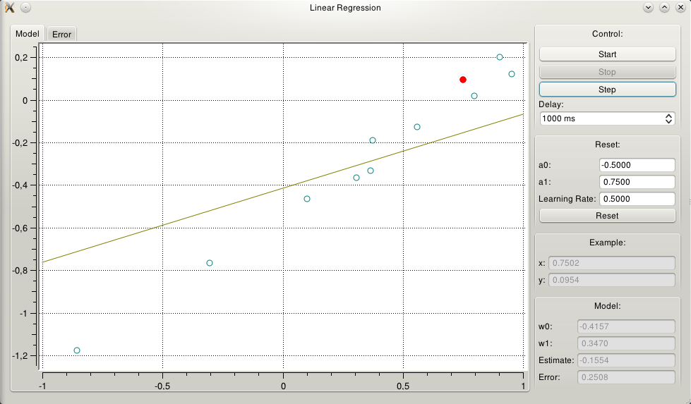

The Linear Regression demo
==========================

This program demonstrates the action of a single neuron with linear activation
in the task of linear regression of a single variable, single valued function.
Although linear neurons can do more than one-to-one regression, this case is
specially good for visualization. This is a demonstration of the Neural Network
package :ref:`nnet`. To run it, you must have the `PyQt4
<http://www.riverbankcomputing.co.uk/>`_ library installed. The demo shows a
window representing the line obtained by the regression, update at each example
shown to the neuron.

Starting the Program
--------------------

Before trying to run the program, please make sure that the required libraries
are installed and working. Usually, they are not difficult to install: Windows
builds come with an installer, and Linux versions can be installed using a
package manager.

The program resides in the ``demos\flock`` folder. If you use Windows, use the
file browser to navigate to that folder and double-click the ``IPApp.py`` file,
and the program should start. In Linux, you can start it by the command line
interface, navigating to the program folder and typing::

    # python LRApp.py

The main window of the program will be shown as in the picture below.

The Visualization Tabs
----------------------

In the left side of the window there is a set of two tabs that allow 
visualization of the process. When the program starts, no data is shown -- the
simulation must start for data to appear. These are the different 
visualizations:

    Model
        Allows one to see the adaptation of the model. Three distinct sets of
        objects are shown in this plot: a dark yellow line representing the
        regression line obtained until the moment; a set of blue dots
        representing the past examples shown to the neuron; and a red dot
        representing the last example shown to the neuron. This screen is
        updated at the presentation of each example: as soon as the neuron
        learns, the line is updated, the red dot is transformed to a blue dot,
        and a new example is randomly choosed.

        It is interesting to notice that examples are computed from a given
        model (see more in Controlling, below) with some noise added.

    Error
        This tab shows the progression of the error as a function of the number
        of presented examples. The plot is updated to include the computed error
        (the euclidian norm of the difference from the computed and the desired
        response) for every example presented to the neuron.

Control Panel
-------------

With this panel it is possible to control the simulation. Three buttons allow to
start, stop and step over the animation, and the visualization in the active
tab is updated accordingly.

    Start
        Starts the animation. When the animation is running, this button is
        made inactive.

    Stop
        Stops the animation if it is running. This button is normally inactive,
        but is made active when the animation is running.

    Step
        Performs a single step of the control: given the values of the angular
        position and speed, calculates the force that should be applied to the
        cart and updates the view. This button is made inactive when the
        animation is running.

    Delay
        This spin box allows to set an interval of time as a delay between
        updates. Between the presentation of one example and another, there will
        be a delay of the duration given by this box (in miliseconds). This will
        allow to understand better what the simulation is doing. Notice that the
        value here can be made 0 -- in this case, no wait will happen.

Configuration Panel
-------------------

The configuration allows to change the parameters of the task. The model being
mapped can be changed, and the learning rate of the neuron can be set.

    a0
        This sets the linear coefficient of the model being mapped. This is the
        basic line from where the examples are taken: the independent variable
        is randomly chosen in the interval (-1, 1), and the desired response is
        computed with the model given by `a0` and `a1` (see below), with a small
        amount of gaussian noise added. Changing this value will change the
        model. Notice that this will only be effective once the `Reset` button 
        is pressed.

    a1
        This sets the angular coefficient of the model being mapped. This is the
        basic line from where the examples are taken: the independent variable
        is randomly chosen in the interval (-1, 1), and the desired response is
        computed with the model given by `a0` (see above) and `a1`, with a small
        amount of gaussian noise added. Changing this value will change the
        model. Notice that this will only be effective once the `Reset` button 
        is pressed.

    Learning Rate
        This parameter controls the speed of the convergence. It is the standard
        learning rate parameter. When this is made small, the convergence is
        slower, but more precise. When this is made large, the convergence is
        faster, but less precise. If this is made really large, the algorithm
        diverges. It can be fun toying with this value to see its effect on
        learning.

    Reset
        The modifications made in the boxes above are only made effective once
        this button is pressed.

Example
-------

This panel shows the example being shown to the neuron. Its coordinates
corresponds to the position of the red dot in the plot window. Once the example
is presented to the neuron, it is automatically updated: the horizontal 
coordinate is randomly chosen in the interval (-1, 1) with uniform distribution,
and the vertical coordinate is computed from the model given by `a0` and `a1`
(see above) with a small amount of gaussian noise added. Notice that these boxes
cannot be edited: their only purpose is feedback.

    x
        The horizontal coordinate of the example

    y
        The vertical coordinate of the example

Model
-----

This panel will show how well the neuron is learning the task. The internal
model is of a single input biased neuron, so it has two synaptic weights.
Ideally, with convergence, these weights will converge to the values of `a0` and
`a1` above. Notice that these boxes cannot be edited: their only purpose is 
feedback on the learning process.

    w0
        The bias synaptic weight. Ideally, this value will converge to the `a0`
        value of the model.

    w1
        The input synaptic weight. Ideally, this value will converge to the `a1`
        value of the model.

    Estimate
        Shows the prediction estimate of the neuron given the input `x` and the
        values of synaptic weights of the neuron.

    Error
        Shows the prediction error for this particular example.

