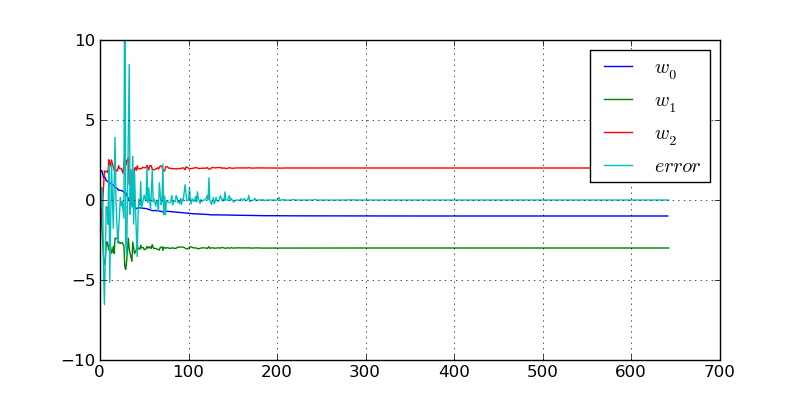

Mapping of a Plane
==================

In this tutorial, we will use a very simple linear neuron to map a plane. The
general equation of a plane is given below:

.. math::

   ax + by + cz + d = 0

We can put the *z* variable as a function of *x* and *y*, so we get:

.. math::

   z = - \frac{a}{c}x - \frac{b}{c} y - \frac{d}{c}

It is easy to see that this is exactly the response of a single neuron with two
inputs, bias and a linear activation function. If that is the case, the response
of a neuron will be given by (notice that the *y* variable here is not the same
s in the previous equation):

.. math::

   y = w_0 + w_1 x_1 + w_2 x_2

where :math:`x_1` and :math:`x_2` are the inputs to the neuron.

So, we can use a neuron to map a plane. The reason to use a neuron instead of
using simple calculations to find the values of the coefficients is that input
data may be noisy, but a neuron has the ability to supress noise, given the
statistical nature of its learning.

We will assume that we are in the Python command line, and that both ``numpy``
and ``peach`` were imported. To create a neuron as described above, we issue the
command:

   >>> nn = FeedForward((2, 1), lrule=LMS(0.02), bias=True)

This will create a ``FeedForward`` with only one layer, with 2 inputs and 1
neuron in it. The default activation function is ``Linear``, so we don't need to
inform that in the creation of the instance. We use the ``LMS`` learning rule,
setting the learning rate to 0.02 -- but notice that we must, here, specify the
argument name, since it is not in its correct position. Last, we set the
``bias`` property as ``True``.

Now we need to create the training set to present to the network. Although there
are ways to present a complete training set to the network, we will use the same
``feed`` method of the previous tutorial. We do this so we can track the
convergence of the synaptic weights (we won't show the code to do that, but it
is very easy to adapt it)::

   >>> error = 1
   >>> while abs(error) > 1e-7:
   ...    x1 = random.uniform(-10, 10)
   ...    x2 = random.uniform(-10, 10)
   ...    x = array([ x1, x2 ])
   ...    y = -1 - 3*x1 + 2*x2
   ...    error = nn.feed(x, y)

We create a loop to generate random points in the plane and calculate the
respective value of the mapped function. We don't add noise here, since the
objective of this tutorial is only to show how to work with the neuron. Notice
that the loop is repeated until the error, returned by the ``feed`` method, is
lower than a fixed value.

At the end of the loop, we can inspect what we got as synaptic weights. Notice
that, given the equation in the code, we expect :math:`w_0 = -1`,
:math:`w_1 = 3` and :math:`w_2 = 2`. What we get is::

   >>> nn[0].weights
   array([[-1.00000409,  2.99999864,  2.00000068]])

which is pretty close to what we expect. Notice that there is some error. This
can't be avoided when dealing with stochastic algorithms (such as learning
algorithms for neural networks).

If we use the ``matplotlib`` module, we can plot the convergence of the error
and synaptic weights of the neuron. We get something like the figure below:

